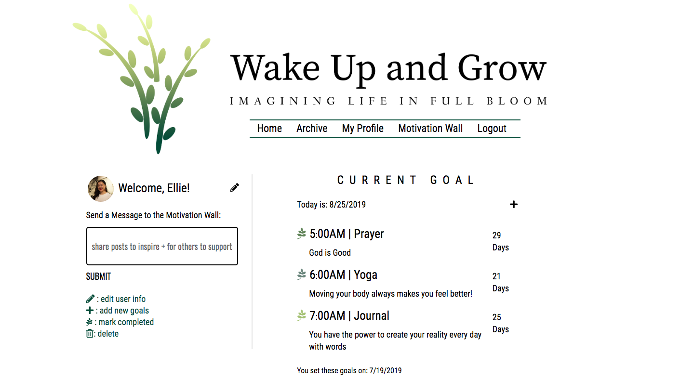

# Wake Up and Grow Full-stack Web Application

### Goal: Full-stack web app that that enables users to set goals and sends text reminders / plays sound if app is open. Users can also encourage each other through the "Motivation Wall", sending text encouragement throughout the day. (Not optimized for no text messaging.)

## Design and Development:
**Tech Used** HTML, CSS, JavaScript, Node, Express, EJS, MongoDB, Passport User Authentication, Nexmo for text messaging

## Installation
1. Clone repo
2. run `npm install`
3. create `.env` file with:
**USER_NAME = username**
**USER_PASSWORD = password**
**DB_NAME = database name**

## Usage
1. run `npm start .env`
2. Navigate to `localhost:999`

## Important
**only application with US phone numbers. do not start with "1", it is included in code.**
